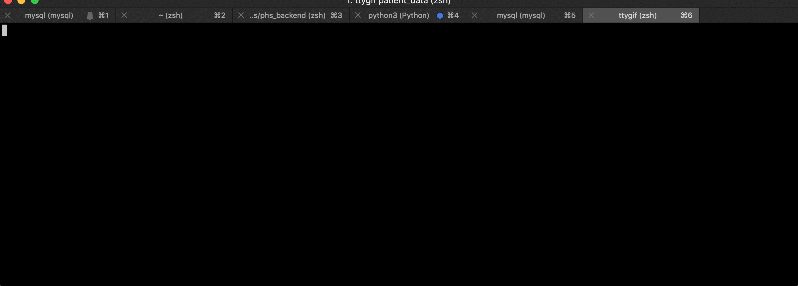

# personal health systems backend

## Table of Contents
1. [API](#API)
    1. [Patient data within Unix timestamp window](#Patient-data)
    2. [Sending a message](#Sending-a-message)
    3. [Retrieving all messages by patient ID](#Retrieving-messages)
    4. [Getting patient measures](#Patient-measures)
2. [Local development](#Local-development)

## API

### Patient data
* URL: `POST /patient/<patient_last_name>/<patient_first_name>?start=<start_timestamp>&end=<end_timestamp>`
* Input: 
    * `start` - a unix timestamp that serves as the start of the time window, in which all time series measures (heart rate, activity type, steps per minute) will succeed.
    * `end` - a unix timestamp that serves as the end of the time window, in which all time series measures will precede. 

* Output: 
    ``` 
    "meta": {
        "message": "ok",
        "status_code": 200
    },
    "response": {
        "first_name": "Christopher",
        "last_name": "Riesbeck",
        "birth_date": "1961:01:11",
        "doctor": {
            "id": 2,
            "first_name": "Ilya",
            "last_name": "Mikhelson"
        },
        "heart_rate_measures": [
            {
                "heart_rate_measure": 82,
                "patient_id": 7,
                "rr": 731.707,
                "unix_timestamp": 1477309487
            }
            .
            .
            .
        ],
        "activity_type_measures": [
            {
                "activity_type": 0,
                "patient_id": 1,
                "unix_timestamp": 1477309036
            },
            .
            .
            .
        ],
        "steps": [
            {
                "num_steps": 0,
                "patient_id": 7,
                "unix_timestamp": 1477309036
            },
            .
            .
            .
        ],
        "medications": [ ... ],
        "messages": [ ... ]
    }
    ```
* Example:

    

### Sending a message
* URL: POST `/message`
* Input: JSON 
    ```
    {
        "doctor_id":    <int>  // The id of the doctor
        "patient_id":   <int>  // The id of the patient
        "from_patient": <bool> // True or False whether the patient is the sender
        "message_text"  <str>  // Content of the message
    }
    ```
* Output:
    ``` 
    {
        "meta": {
            "message": "ok",
            "status_code": 200
        },
        "response": {
            "date_sent": 1542756866,
            "doctor_id": 1,
            "from_patient": true,
            "id": 1,
            "message_text": "hello world",
            "patient_id": 1
        }
    }   
    ```

### Retrieving messages
* URL: `GET /patient/<patient_id>/messages`
* Description: Retrieve all messages to and from a given patient based on patient id
* Input: 
    * `patient_id` - record id of patient
* Output:
    ```
    "meta": {
        "message": "ok",
        "status_code": 200
    },
    "response": [
        {
            "date_sent": 1543034107,
            "doctor_id": 1,
            "from_patient": true,
            "id": 2,
            "message_text": "hello world",
            "patient_id": 7
        },
        .
        .
        .
    ]
    ```
    
### Patient Measures
* URL: `GET /patient/<patient_id>?start=<start_timestamp>&end=<end_timestamp>`
* Description: Get time-domain and non-linear measures based on patient's heart rate variability in a given time frame
* Input: 
    * `patient_id` - record id of patient
    * `start` - a unix timestamp that serves as the start of the time window, in which all time series measures (heart rate, activity type, steps per minute) will succeed.
    * `end` - a unix timestamp that serves as the end of the time window, in which all time series measures will precede. 
* Output: 
    ``` 
    "meta": {
        "message": "ok",
        "status_code": 200
    },
    "response": { 
        "non_linear_measures": {
            "dfa": {
                "scales": [ ... ],                  # x-axis (int)
                "fluctuation_coefficients": [ ... ] # y-axis (float)
                "alpha": 0.7524498709660283         # scaling parameter (float)
            },
            "sample_entropy":  0.6379832855154047   # (float)
        },
        "time_domain_measures": {
            "ann": 752.7476329113924,
            "pnn20": 28.227848101265824,
            "pnn50": 8.60759493670886,
            "rmssd": 60.97512189933899,
            "sdnn": 84.18717994076752
        }
    }
    ```

## Local development
### Program Requirements

* Python 3.6.*
* MySQL 5.6.*
* Pip

### Installation

* Clone this repo: `git clone https://github.com/sql-injection/phs-backend.git`
* `cd phs-backend/`
* `pip install -r ./requirements.txt --no-cache-dir`
* Create a `.env` file in the root project directory, containing:

| environment variable  | definition                                                         | required | value                 | default      |
|-----------------------|--------------------------------------------------------------------|----------|-----------------------|--------------|
| `FLASK_ENV`           | Flask environment mode                                             | True     | "development"         | "production" |
| `FLASK_APP`           | Root file of the project                                           | True     | "app/app.py"          | None         |
| `DEVELOPMENT_DB_USER` | Username that has all permissions to your MySQL database instance  | False    | <your_mysql_username> | "test_user"  |
| `DEVELOPMENT_DB_PASSWORD`| Password associated with MySQL user | False | <your_mysql_password> | "test_password" |
| `DEVELOPMENT_DB_NAME` | Name of your local MySQL database | False | <your_mysql_db_name> | "phs_backend"
| `DEVELOPMENT_DB_HOST` | Where your db lives | False | <your_local_host> | "localhost"
| `DEVELOPMENT_DB_PORT` | Port at which your db lives | False | <your_local_port> | 3306

* Set up MySQL:
    * Run MySQL daemon
    * Set up a local test MySQL user
        * `mysql -u root -p`
        * `create database phs_backend;`
        * `use phs_backend;`
        * Grant permissions to a new user: `grant all PRIVILEGES on *.* to 'test_user'@'localhost' identified by 'test_password';`
        * Log out (Ctrl+D) and log in to test your newly created user: `mysql -u test_user -p`.
* Load models 
    * `flask db upgrade`
* Load patients and doctors
    * `python scripts/load_dummy_data.py --db <db_name> --host localhost --user <username> --password <password>`
* Load in patient CSVs
    * `python scripts/load_all_patient_csvs.py --db <db_name> --host localhost --user <username> --password <password>`
* Start a local server
    * `python -m flask run`
    
   
